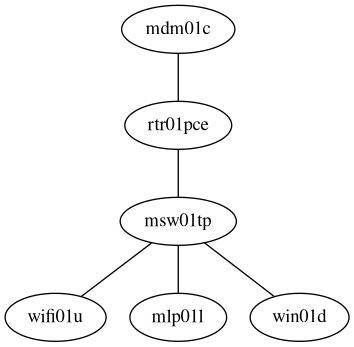

# ctha.ja4.org (DNET)

The config exists, but I don't have access to it at the moment, need to reboot into the Linux environment to use my SSH keys...

## Network Topology

## Configurations

* cthartr01p
    * [Router Config](configuration.nix)
    * [Hardware Config](hardware-configuration.nix)