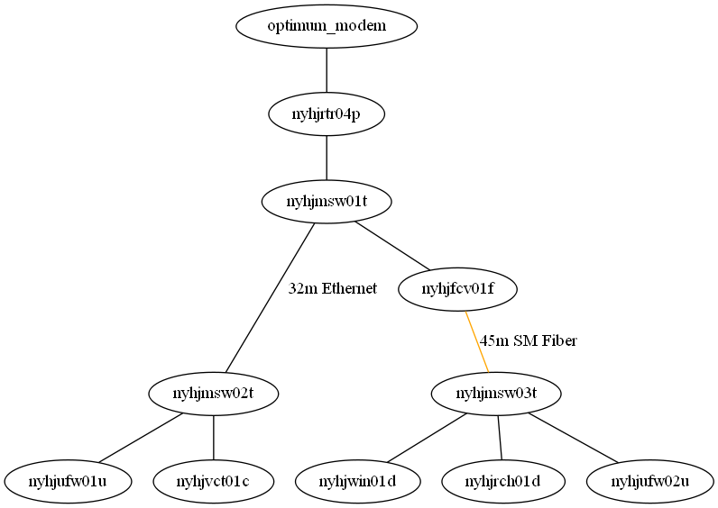

# nyhj.ja4.org (Eagle's Nest)

All configurations are on consumer hardware or in an exported Unifi Controller Site Config.
There are no (reasonable) configuration files to put in this folder.

## Network Topology

## Documentation

| Hostname | Sticker | IP | Description |
| --- | --- | --- | --- |
| `mdm01nw` | `nyhjmdm01n` | `192.168.100.1` | Modem |
| `rtr05nw` | `nyhjrtr05n` | `192.168.10.1` | Router |
| `msw01tp` | `nyhjmsw01t` | `192.168.10.2` | TP Link TL-SG105E |
| `fcv01mc` | `nyhjfcv01f` | N/A | TP Link MC220L |
| `fcv02mc` | `nyhjfcv02f` | N/A | TP Link MC220L |
| `wifi01u` | `nyhjufw01u` | DHCP | Unifi WiFi AC LR |
| `wifi02u` | `nyhjufw02u` | DHCP | Unifi WiFi AC LR |
| `cell01o` | `nyhjvct01o` | DHCP | Verizon Cell Tower |