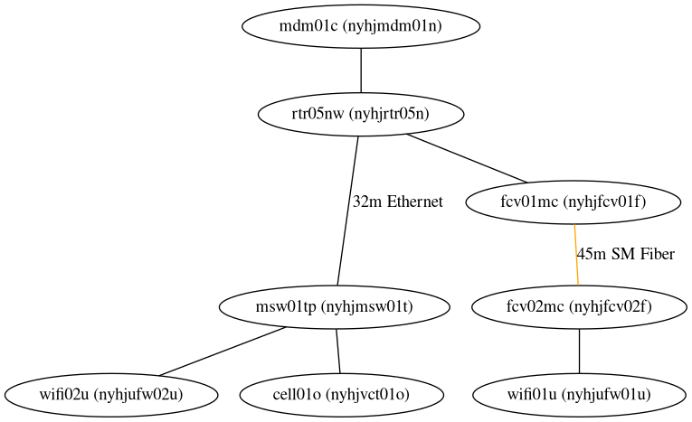

# nyhj.ja4.org (Eagle's Nest)

All configurations are on consumer hardware or in an exported Unifi Controller Site Config.
There are no (reasonable) configuration files to put in this folder.

## Network Topology

## Configurations

* `nyhjmdm01n` is `192.168.100.1`
* `nyhjrtr05n` is `192.168.10.1`
* `nyhjmsw` is `192.168.10.2`
* Everything else is dynamic IP

Hopefully, there will be a Raspberry Pi 3 installed on the WiFi that communicates via Wireguard to some systems in
`ohhi`, but that is yet to be implemented.