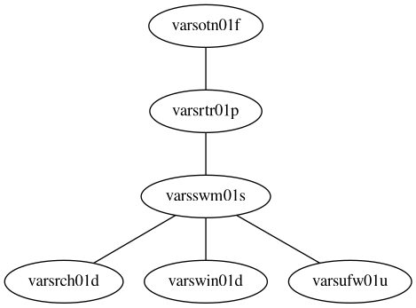

# vars.ja4.org (VARS)

## Network Topology

| hostname | IP | Details |
| --- | --- |--- |
| `rtr01pce` | `10.1` | PC Engines Router (apu 3c4) |
| `msw01tp` | `10.2` | TP Link T2500G-10TS |
| `wifi01u` | `10.3` | Unifi Wifi AC LR |
| `vmh01d` | `10.5`  | VM Host |
| `arch01d`, `win01d` | `10.10` | Desktop |
| `print01hp` | `10.0.2.20` | HP Officejet 9015 |
| `nest01go` | `10.0.2.22` | Nest Thermostat |
| `alexa01az` | `10.0.2.21` | Alexa |
| `eln01` | `10.0.0.30` | LL Dev Server |
| `mm01` | `10.0.0.31` | Mattermost [https://chat.ja13.org](https://chat.ja13.org) |

## Configurations

* `rtr01pce`:
    * [Router Config](rtr01pce.nix)
    * [Hardware Config](hardware/rtr01pce.nix)

* `vmh01d`:
    * [VM Host Config](vmh01d.nix)
    * [Hardware Config](hardware/vmh01d.nix)