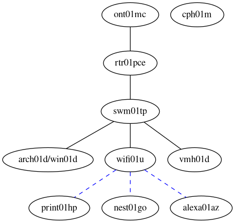

# vars.ja4.org (VARS)

## Network Topology

## Configurations

* varsrtr01p
    * [Cable Config](configuration.fiber.nix)
    * [LTE Config](configuration.lte.nix)
    * [Hardware Config](hardware-configuration.nix)